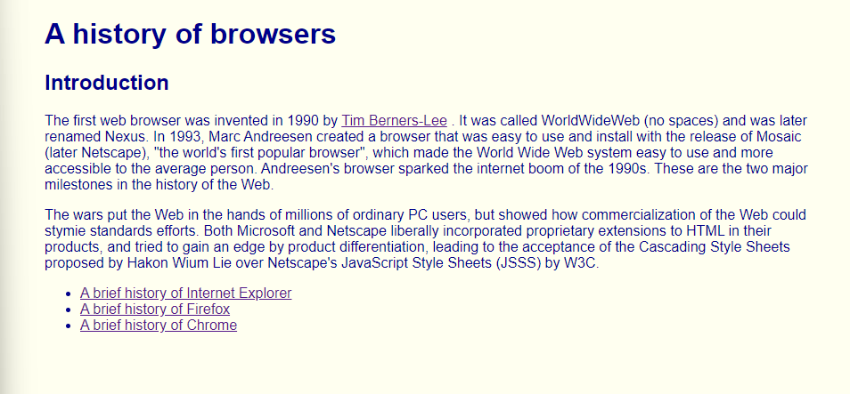
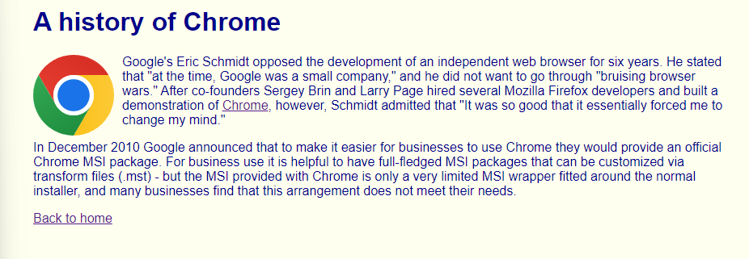
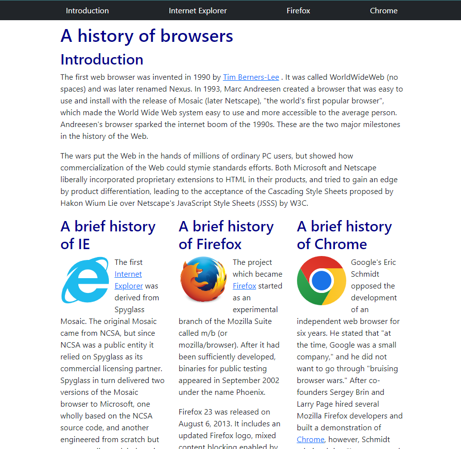

## The Raw HTML and CSS Experience

Having no prior experience with HTML and CSS, learning how to make a website was a very interesting process. There are so many specific keywords that make the code so hard to read as the code gets longer. Even though I was given resources to help me learn HTML and CSS, I still put in a lot of personal time to figure out how to make certain things appear on my practice website the way I wanted them to appear. The images above are a website that I made and edited using raw HTML and CSS. Each bullet point is a link that brings you to another page with the image of the browser and a summary of how it was created. It was a fairly long process to make as again, I needed to understand how to make bulleted text and how to make certain pieces of text link to a different page. Also, a big problem I had was trying to figure out how to embed the browser's logo in the top right of the text without making the text look weird. Like all other programming languages, time is needed to understand how to use and manipulate code to work in your favor, and even though using raw HTML and CSS is a hassle, I was still able to overcome and figure out how to make my website the way I wanted.  

## Wish Everything Was This Easy

After going through how exhausting using raw HTML and CSS can be and getting through that part of my learning, I was then introduced to Bootstrap 5. Bootstrap 5 is a UI Framework that has a vast amount of tools, components, libraries, and design elements that make life easier for software developers. It offers a wide range of pre-designed templates, responsive grids, and CSS classes that can be easily integrated into your project, saving developers a significant amount of time and effort. Having learned how to use Bootstrap, I adjusted my raw HTML and CSS code to use more tools offered by Bootstrap. Three of the main tools that I used were Containers, the Grid system, and Navbar. These tools helped me produce a website that was aesthetically pleasing and evenly spaced throughout the whole page. Having the Grid System tool automatically puts each of my browser history neatly in a row.

## A Useful Tool Called Bootstrap

While learning raw HTML and CSS is essential for a deeper understanding of web development, Bootstrap serves as a powerful tool to help speed up the development process and achieve better results more efficiently. By using Bootstrap, developers can leverage the collective knowledge and best practices of the web development community, leading to cleaner code, reduced maintenance, and improved collaboration among team members. Bootstrap 5 offers a substantial return on the investment of time and effort by providing a vast and powerful set of tools and components that simplify web development. It enables developers to create visually appealing and functional websites or applications with ease. While learning raw HTML and CSS is valuable, using a UI framework like Bootstrap can significantly enhance productivity and the overall quality of web projects.
