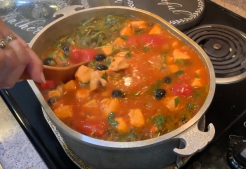
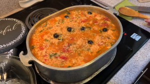
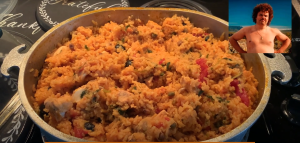

  
  
  

Paragraph 1

Paragraph 2

Paragraph 3

Youtube link: [Gandule Rice]([https://github.com/jonahlene/bankdatabase.io/blob/main/database.c](https://www.youtube.com/watch?v=edRbLPh6tJA)https://www.youtube.com/watch?v=edRbLPh6tJA).
